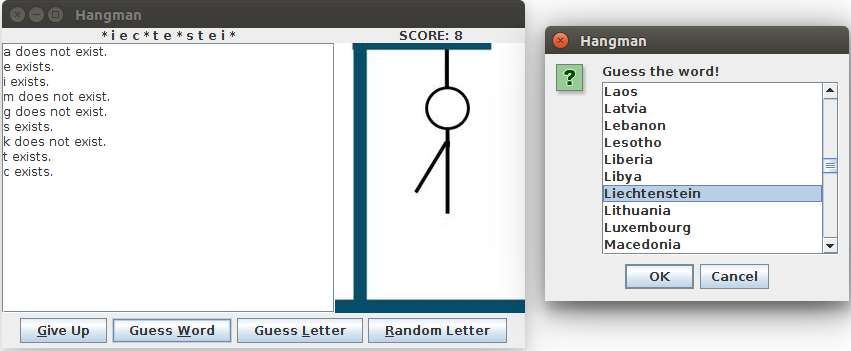

# Hangman

Remake of the classic game with customization options for adding variety.

## Gameplay & Features

- Guess the words case-insensitively or guess a letter.
- Also randomly guess a letter or give up.
- Choose a letter from the list or enter it manually.
- Informing about which letters are already guessed before.
- Score starts from the length of the word.
- Correct guess of a letter decreases your score.
- Wrong guess of a letter increases the sticks in the hangman figure.
- Controlling whether the guessed letter is already guessed before or not.
- Select a word from the list or enter it manually.
- Informing about which words are already used before.
- Wrong guess of the word increases the sticks in the hangman figure.
- Choose whether to continue to round or give up when the hangman figure is completed.
- Controlling the completion of the word and the words in the database.
- Viewing detailed statistics about score at the end.
- Words contain letters only from English alphabet.
- Blank spaces and correctly guessed letters are viewed as they are.
- Letters that you have not guessed yet are viewed as \*.

You can set the customization options using _HangmanConfiguration.ini_ file after building (Hard-coding options into code is not necessary). This file is read before every round so you can play each round with different options.

## Customizations

- Select the way to guess the letters (entering them or choosing one of them from the list).
- Select the way to guess the words (entering them or choosing one of them from the list).
- Choose whether to delete the word from the database after it is used.
- Choose whether to delete the name from the list of names after it is used.
- Specify the sticks in the hangman figure.
- Specify the database file (one word per line in a txt file).
